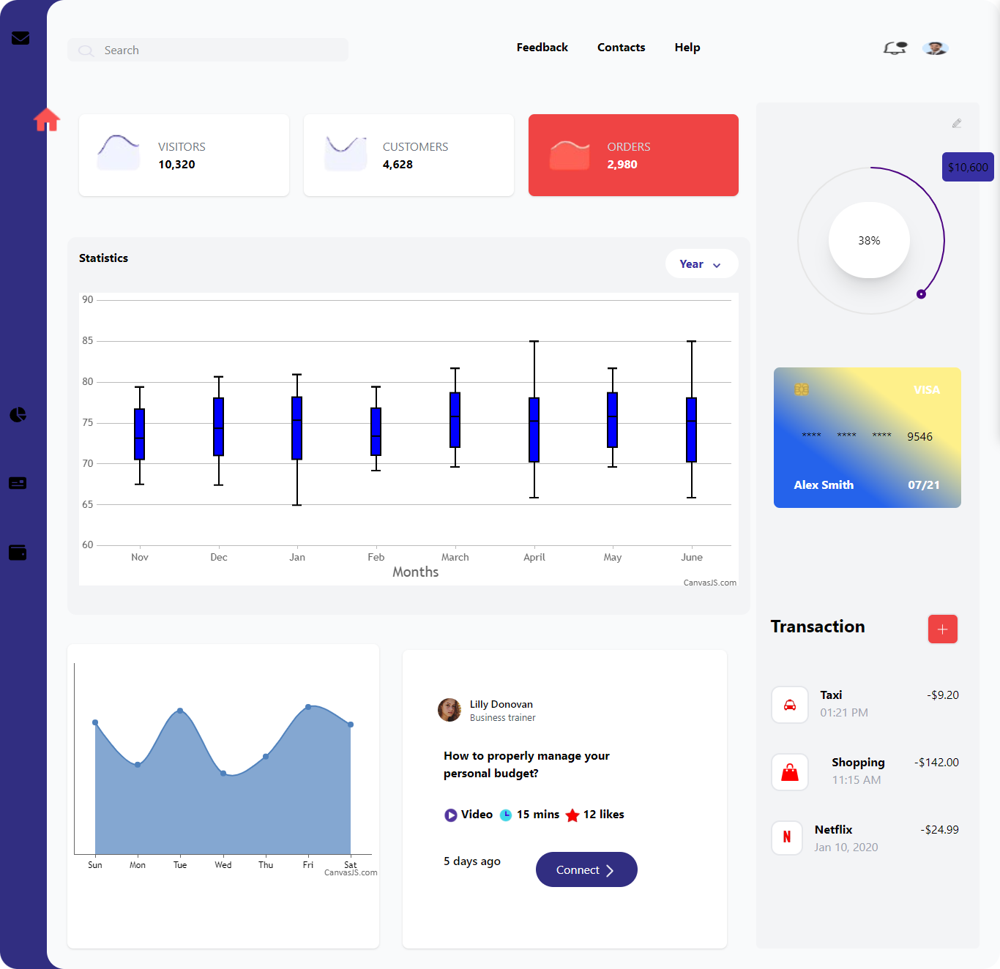

# Onfleeqk Assessment

## Overview

This project is a frontend assessment built using React and TailwindCSS. It includes a circular progress bar using `react-customizable-progressbar` and various charts including spline and box & whisker charts using `@canvasjs/react-charts`.


### Prerequisites

- Node.js
- npm (Node Package Manager)
## Technologies Used

- **React**: A JavaScript library for building user interfaces.
- **TailwindCSS**: A utility-first CSS framework.
- **react-customizable-progressbar**: A customizable progress bar component for React.
- **@canvasjs/react-charts**: CanvasJS React Charts for rendering spline, box & whisker, and candlestick charts.

### Installation Steps

1. Clone the repository:
    ```bash
    git clone <your-repo-url>
    ```
2. Navigate to the project directory:
    ```bash
    cd onfleeqk-assessment
    ```
3. Install the dependencies:
    ```bash
    npm install
    ```

## Running the Project

To run the project, use the following command:

```bash
npm start
```
## Running the Project

To start the development server and view the application, navigate to [http://localhost:3000](http://localhost:3000) in your web browser.


## Responsiveness

The project is designed to be responsive across various screen sizes and devices.

## Challenges

- **Design Images**: The design provided in the Figma file was an image, making it difficult to export all images. As a result, I had to improvise with the available assets.
- **Candlestick Chart**: I couldn't replicate the exact candlestick chart from the design, so I used the closest available alternative.

## Contributing

Contributions are welcome! If you have any suggestions or improvements, feel free to open a pull request or issue.

## License

Distributed under the MIT License. See `LICENSE` for more information.


## Live Demo

[https://onfleeqk-assessment.vercel.app/](#)

## GitHub Repository

[https://github.com/Rike12/onfleeqk-assessment](#)

## Screenshot




## Contact

Name - mutiat900@gmail.com

Github: [https://github.com/Rike12/](#)